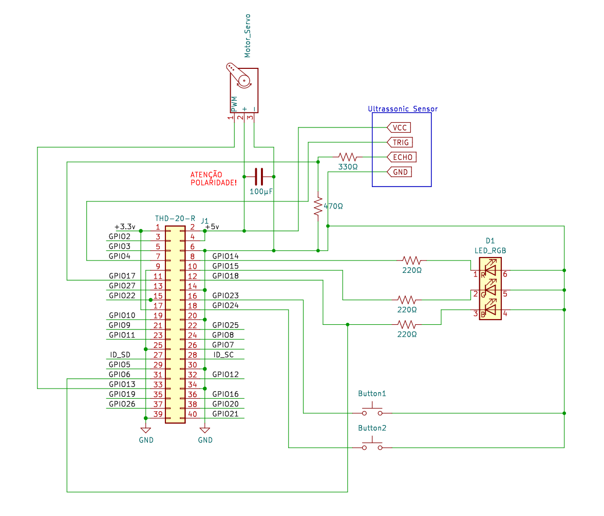
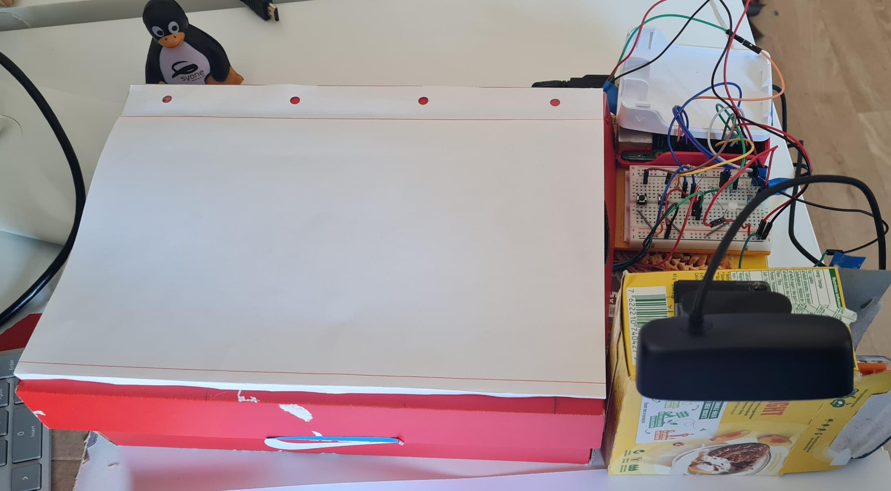

# Smart Bin

We've developed a raspberry pi based recycling bin with a camera capable of recognizing and classifying trash.

This README will explain:
1. The hardware and software requirements
2. How to set it up (both the electric circuits and software)
3. Information about it's operation.

## General Information

Our objective is to incentivize people to recycle by making it easier for people to correctly separate trash. The product will tell the user the correct place to put it's recycling trash (cardboard, metal/plastic and glass)

## Built With

### Hardware

* [Raspberry Pi 4B](https://www.raspberrypi.com/products/raspberry-pi-4-model-b/) - 1 unit - Development board for ...
* [Ultrasonic Sensor](https://mauser.pt/catalog/product_info.php?products_id=096-6220) - 1 unit - For detecting trash in the box
* [Webcam](https://www.asus.com/pt/accessories/streaming-kits/all-series/asus-webcam-c3/techspec/) - 1 unit - for taking a photo of the trash
* [Servo Motor](https://store.arduino.cc/products/arduino-starter-kit-multi-language#product-tech) - 1 unit - for opening the lid

### Software

* [Raspberry Pi OS](https://www.raspberrypi.com/software/) - Operating system
* [Python](https://www.python.org/) - Programming Language and Platform
* [Tensorflow](https://www.tensorflow.org/) - Machine learning framework
* [Base dataset](https://github.com/VIJAY-GADRE/Waste_Classification_using_ResNet152/tree/main)
* [gRPC](https://grpc.io/) - For communication
* [gpiozero](https://gpiozero.readthedocs.io/en/latest/) - Python library for controlling GPIO Pins


## Getting Started

These instructions will get you a copy of the project up and running on for testing purposes.  

### Assembly Instructions
1. Assemble the electronics according to this diagram:


2. Then connect the webcam to the raspberry pi (usb 2.0)
3. Place the ultrasonic sensor in the box of the trash can. Make sure there is a direct line of sight with the other side of the box
   > **NOTE**: The ranges of the ultrasonic sensor are very dependent on the box used, if it's necessary to make any changes please edit these constants from `clientService.py`
   > ```py
   > TRASH_DISTANCE = 0.25
   > CLOSER_PLASTIC = 0
   > FARTHER_PLASTIC = 0.09
   > CLOSER_CARDBOARD = 0.09
   > FARTHER_CARDBOARD = 0.19
   > CLOSER_GLASS = 0.19
   > FARTHER_GLASS = 0.25
   > ```
   > The program in `util/testUltra.py` prints the reading of the sensor
4. Tape a metal wire to the servo and place it in a position where it can open the lid
5. Connect power to the raspberry pi

### Software Prerequisites

Please ensure that both the remote computer (server) and raspberry pi (client) are in the same network and reachable

We tested the server program in linux environments

The client uses GPIO functions and therefore can only be executed in a raspberry pi

### Installation

This part has to be done in **both** the remote computer and the raspberry pi

1. Download the repository
2. Install the virtual environment and packages with:
   ```sh
   make install
   ```
3. Select the virtual environment with:
   ```sh
   source .venv/bin/activate
   ```
4. Compile protobuf with
   ```sh
   make compile
   ```

**IMPORTANT!** It may be necessary to change the address and port of the server, this can be done by editing the variable `SERVER_PORT` at the top of the `client.py` and `server.py` files

### For the computer (server)
```sh
cd server
python server.py
```
**NOTE**: The model may take a few minutes to initialize. Once the server is ready it will show `Started Server on <address>`

> The server uses pre-trained models (`retrained_model.keras`). The code to build this model from scratch can be run with `python modelTrain.py` (heavy operation, requires `WasteImagesDataset.zip` to be extracted).

### For the raspberry pi (client):
```sh
cd client
python client.py
```

### Testing

We haven't implemented any unit or integration testing. There are, however, some utilities that may help test and debug the circuit/code:
```sh
cd util
python testServo.py # this testes the servo movement (from MIN pos to MAX)
python testUltra.py # this prints the output of the ultrasonic sensor (1s interval)
```

## Demo
When it's all ready, you should have a setup like this:



When someone wants to deposit trash it places it under the webcam and clicks on the left button. This will make the camera take a photo. Then the lid will open and the RGB Led will present the corresponding trash code (blue -- paper, yellow -- plastic and metal, green -- glass). Once the user deposits the trash the lid will close.

If the machine learning model is not confident in it's results or if the user notices the model made a mistake (by clicking in the button on the right), the lid will open and a photo of the product + the location where the user placed it will be sent to the remote machine as training data. Once more photos are collected (absolute minimum of 10) the model can be further trained in these images (hopefully) making it more accurate

## Additional Information

### Authors

* **Adriana Nunes** ist199172
* **Francisco Carvalho** ist199219
* **Martim Baltazar** ist199280