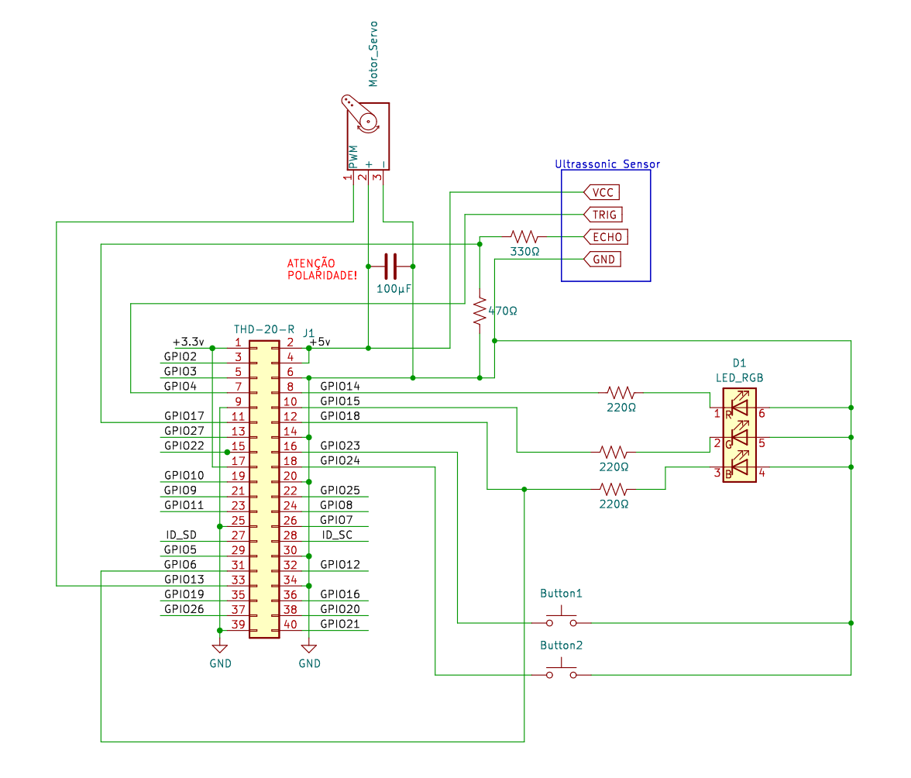

# Smart Bin

We've developed a recycling bin with a camera capable of recognizing and classifying trash

> Begin with an introductory paragraph that tells readers the purpose of your solution with hardware and software and its major benefits. 
> Give them a summary of the information you will include in this file using clearly defined sections.

## General Information

Our objective is to incentivize people to recycle by making it easier for people to correctly separate trash ... 

> This section expands on the introductory paragraph to give readers a better understanding of your project. 
> Include a brief description and answer the question, "what problem does this project solve?"

## Built With

> Include an outline of the technologies in the project, such as hardware components (Arduino/Raspberry Pi), operating systems, programming language, database, libraries.

> Include links to any related projects (for example, whether this API has corresponding iOS or Android clients), links to online tools related to the application (such as the project web site, the shared file storage).
> If you mention something, please provide links.

### Hardware

* [Raspberry Pi 4B](https://www.raspberrypi.com/products/raspberry-pi-4-model-b/) - 1 unit - Development board for ...
* [Ultrasonic Sensor](https://mauser.pt/catalog/product_info.php?products_id=096-6220) - 1 unit - For detecting trash in the box
* [Webcam](https://www.asus.com/pt/accessories/streaming-kits/all-series/asus-webcam-c3/techspec/) - 1 unit - for taking a photo of the trash
* [Servo Motor](https://store.arduino.cc/products/arduino-starter-kit-multi-language#product-tech) - 1 unit - for opening the lid

### Software

* [Raspberry Pi OS](https://www.raspberrypi.com/software/) - Operating system
* [Python](https://www.python.org/) - Programming Language and Platform
* [Tensorflow](https://www.tensorflow.org/) - Machine learning framework
* [Base dataset](https://github.com/VIJAY-GADRE/Waste_Classification_using_ResNet152/tree/main)
* [gRPC](https://grpc.io/) - For communication
* [gpiozero](https://gpiozero.readthedocs.io/en/latest/) - Python library for controlling GPIO Pins


## Getting Started

These instructions will get you a copy of the project up and running on for testing purposes.  

### Assembly Instructions
1. Assemble the electronics according to this diagram:


2. Then connect the webcam to the raspberry pi (usb 2.0)
3. Place the ultrasonic sensor in the box of the trash can. Make sure there is a direct line of sight with the other side of the box
4. Tape a metal wire to the servo and place it in a position where it can open the lid
5. Connect power to the raspberry pi

### Software Prerequisites

Please ensure that both the remote computer (server) and raspberry pi (client) are in the same network and reachable

> In this section include detailed instructions for installing additiona software the application is dependent upon (such as PostgreSQL database, for example).
> 
> ```
> installation command
> ```
>

### Installation

This part has to be done in both the remote computer and the raspberry pi

1. Download the repository
2. Install the virtual environment and packages with:
   ```sh
   make install
   ```
3. Select the virtual environment with:
   ```sh
   source .venv/bin/activate
   ```
4. Compile protobuf with
   ```sh
   make compile
   ```

**NOTE**: It may be necessary to change the address and port of the server, this can be done by editing the variable `SERVER_PORT` at the top of the `client.py` and `server.py` files

### For the computer (server)
```sh
cd server
python server.py
```
**NOTE**: The model may take a few minutes to initialize. Once the server is ready it will show `Started Server`

### For the raspberry pi (client):
```sh
cd client
python client.py
```

### Testing

> Explain how to run the tests for this system.
> 
> Give users explicit instructions on how to run all necessary tests. 
> 
> Explain what these tests do and why
> 
> ```
> Give an example command
> ```

## Demo
When it's all ready, you should have a setup like this:

*Colocar imagem*


> Give a tour of the best features of the application.
> Add screenshots when relevant.

## Additional Information

### Authors

* **Adriana Nunes** ist199172
* **Francisco Carvalho** ist199219
* **Martim Baltazar** ist199280